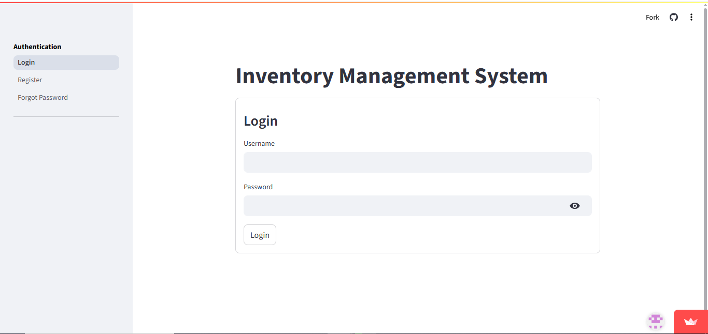
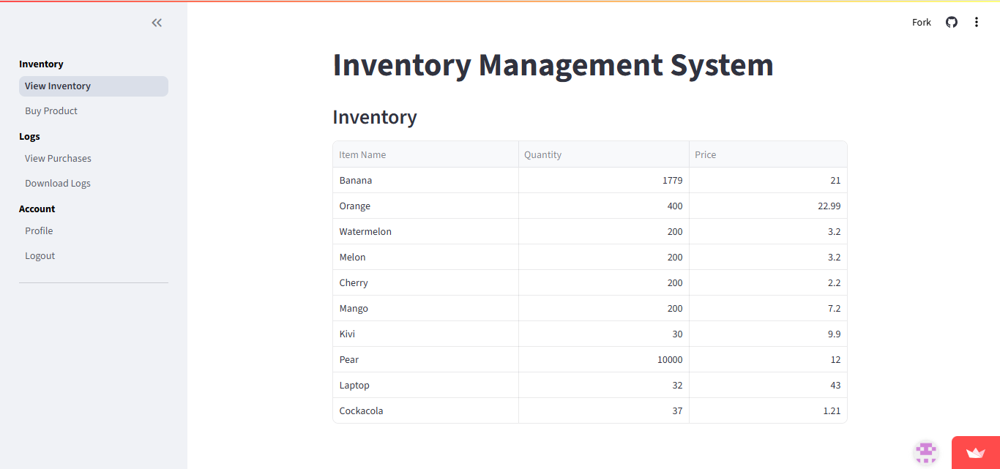
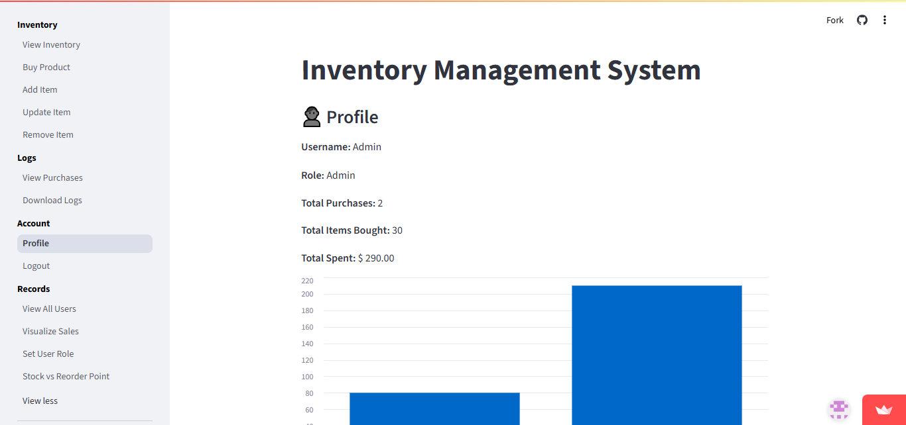
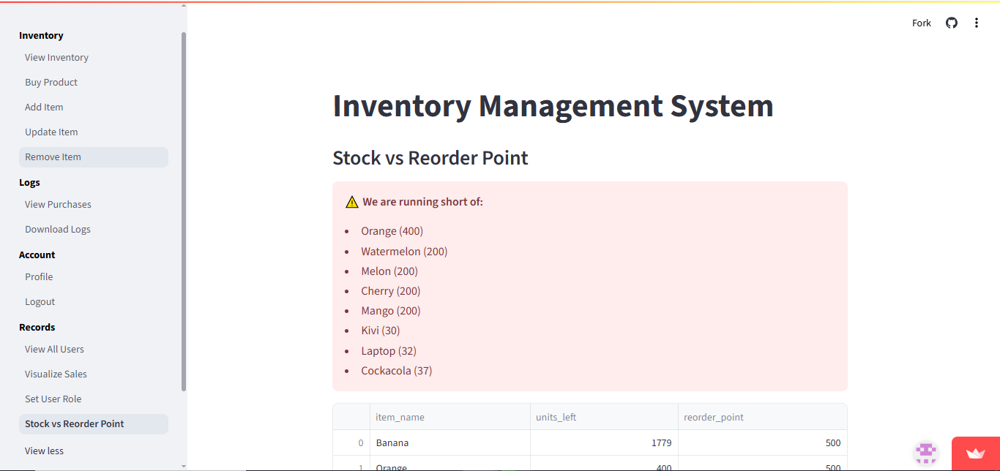
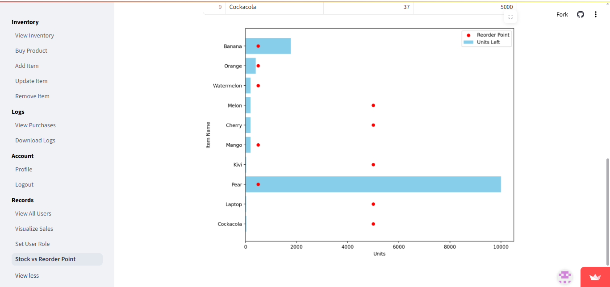

<h1 align="center">📦 Inventory Management System</h1>

<h6 align="center">
  
  
  
  
</h6>

<br>
A powerful and user-friendly **Inventory Management System** built using **Python OOP** and **Streamlit**. Originally a university project, this app has evolved into a full-featured inventory management solution with role-based access, real-time analytics, downloadable logs, and admin dashboards.

🔗 **Live App**: [Try it now →](https://inventory-soft.streamlit.app/)

---

## 🚀 Features

### 🔐 Authentication & Authorization
- User Registration & Login with validations
- Secure Password Reset (character + position verification)
- Role-Based Access Control (Users and Admins)
- Unique usernames only (no duplicates allowed)
- Minimum 8-character password required

### 📦 Inventory Management
- View, Add, Update, and Remove Items
- Real-time stock updates and reorder point alerts
- Case-Insensitive Handling (e.g., "apple" = "Apple" = "ApplE")
- Admin-Only Controls:
   - Add/Remove items with validation
   - Update quantities & prices (No negative values allowed)
   - Set custom reorder thresholds
  
### 🛒 Purchase System
- Customers can buy items easily
- Auto stock deduction & purchase logging

### 📊 Data Analytics & Visualizations
- Daily & historical purchase logs
- Charts by item, user, quantity, and date
- Admin dashboard with full visual insights
- Interactive Charts for:
   - Sales by user, item, or date
- Quantity trends
   - Low-Stock Warnings with visual indicators

### 📥 Logs & Reports
- View and Download logs by date or full history
- Downloadable .txt files for logs

### 👤 User Dashboard
- Profile Page showing purchase stats
- Spending visualization
- Secure password update with security verification

---

## 🧱 Tech Stack

- **Python 3**
- **Streamlit** (Interactive UI)
- **Pandas** (Data Manipulation)
- **Matplotlib / Streamlit Charts** (Visualization)
- **Object-Oriented Programming** (Encapsulation, Inheritance)

---

## 📁 Project Structure

```
inventory-managment-system/
│
├── app.py                      # Main app logic
├── requirements.txt            # Dependency list
└── src/                        # All class-based backend modules
    ├── user_manager.py
    ├── inventory_manager.py
    ├── purchase_manager.py
    ├── admin_manager.py
    └── file_manager.py
```

---

## 🛠️ Run Locally

1. **Clone the repository:**
   ```bash
   git clone https://github.com/Aman-ali76/inventory-management-system.git
   cd inventory-managment-system
   ```

2. **Create virtual environment (optional):**
   ```bash
   python -m venv venv
   source venv/bin/activate  # or venv\Scripts\activate on Windows
   ```

3. **Install requirements:**
   ```bash
   pip install -r requirements.txt
   ```

4. **Run the app:**
   ```bash
   streamlit run app.py
   ```

---

## 🧪 Default Credentials

| Role          | Username | Password |
|---------------|----------|----------|
| Admin         | admin    | admin    |
| Customer/User | user     | user     |

> ⚠️ These credentials are hardcoded for testing. All new usernames must be unique. Passwords must be **at least 8 characters**.

---

## 📷 Screenshots

### 🔐 Login / Register Page


### 📦 Inventory View


### 📊 Admin Dashboard


### 📥 Stock Indication




---

## 👨‍💻 Developer

**Aman Ali**  
🎓 BS Artificial Intelligence | Superior University  
🌐 [Live App](https://inventory-soft.streamlit.app/)  

---

## 🌱 Future Plans

- Firebase or SQLite integration for storage
- Email alerts for low-stock items
- Export reports as PDF or Excel
- Role-based dashboards and activity logs

---

## 🤝 Contributing

Contributions are welcome! Please open an issue or pull request for any improvements.

## 📜 License

For academic and learning purposes. © 2025 Aman Ali
